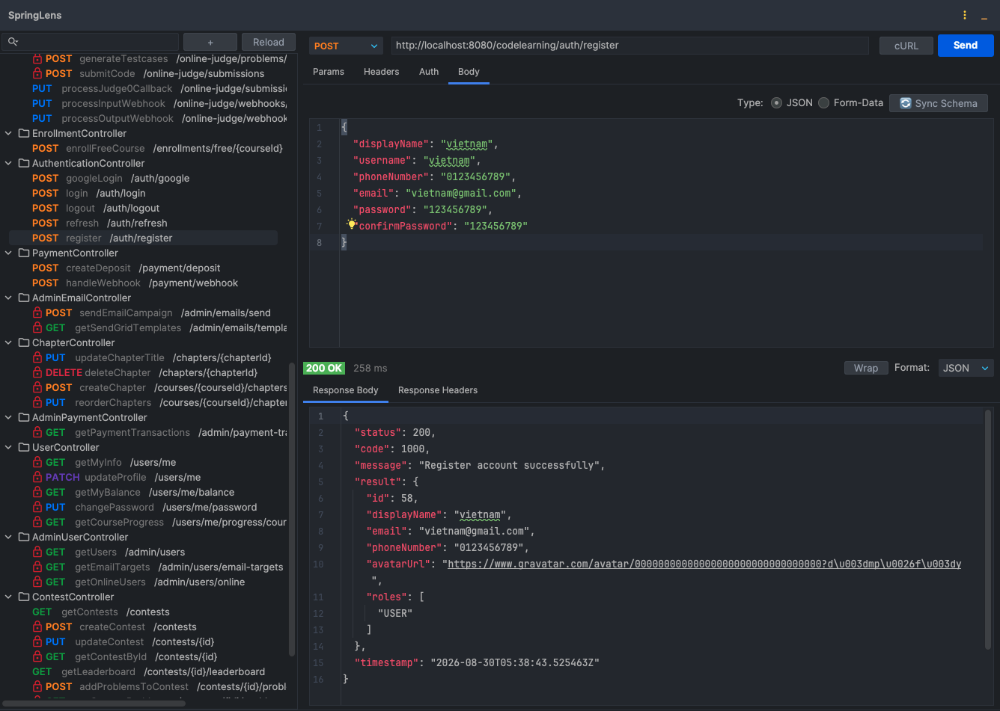
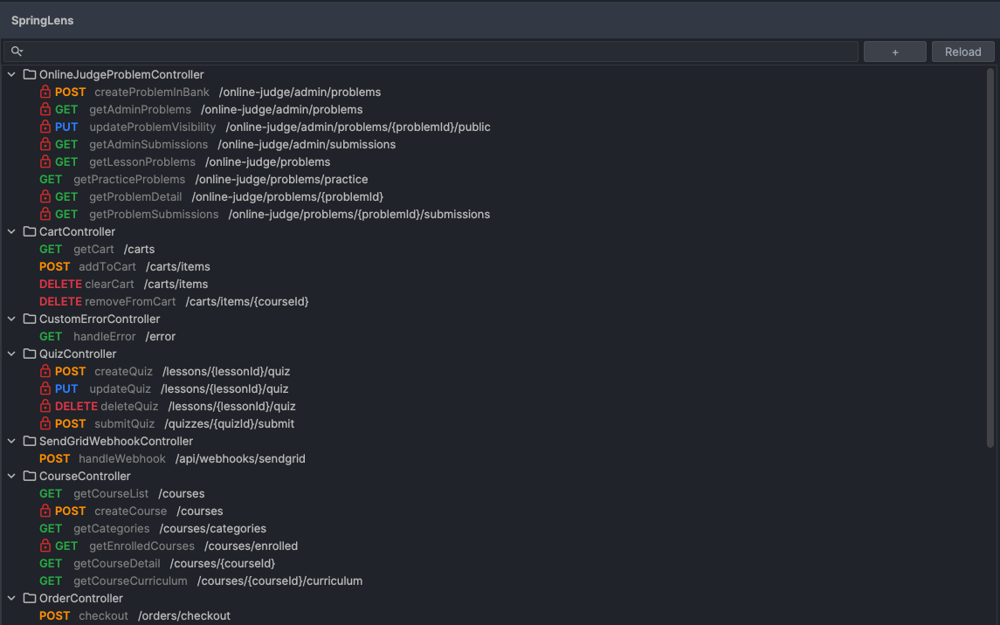
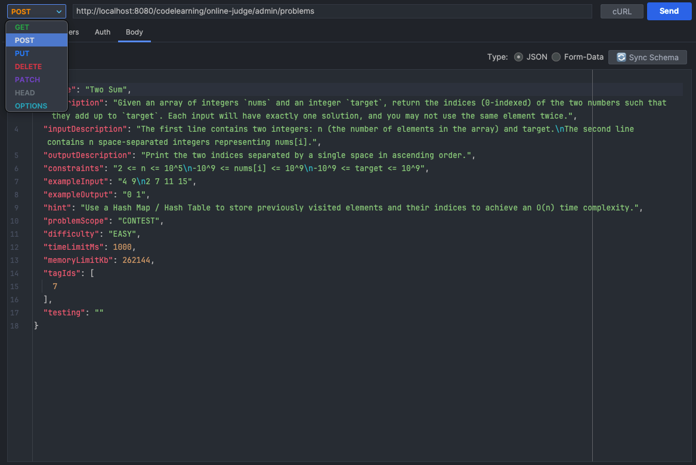
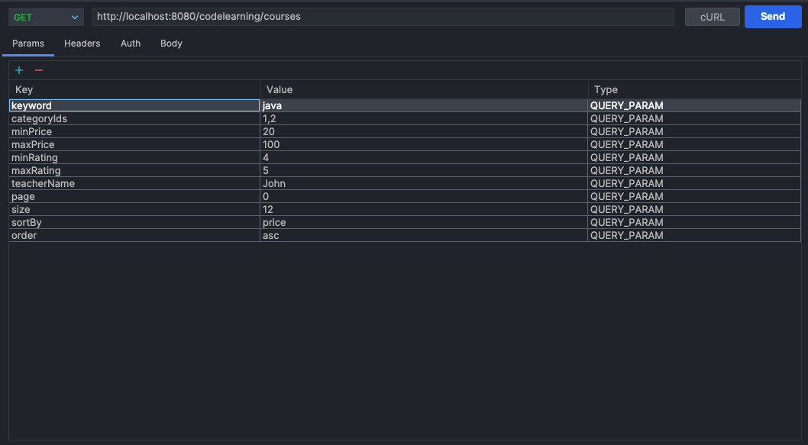
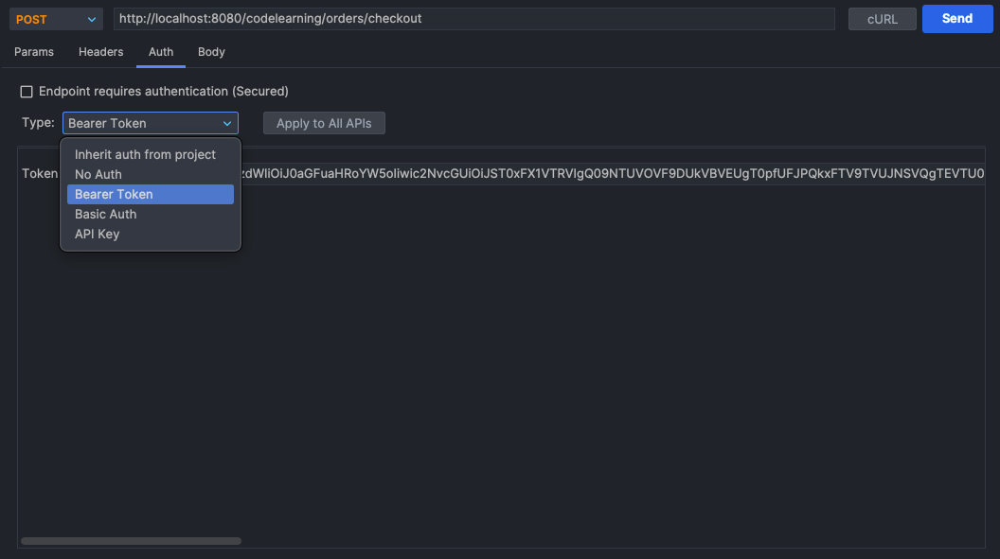
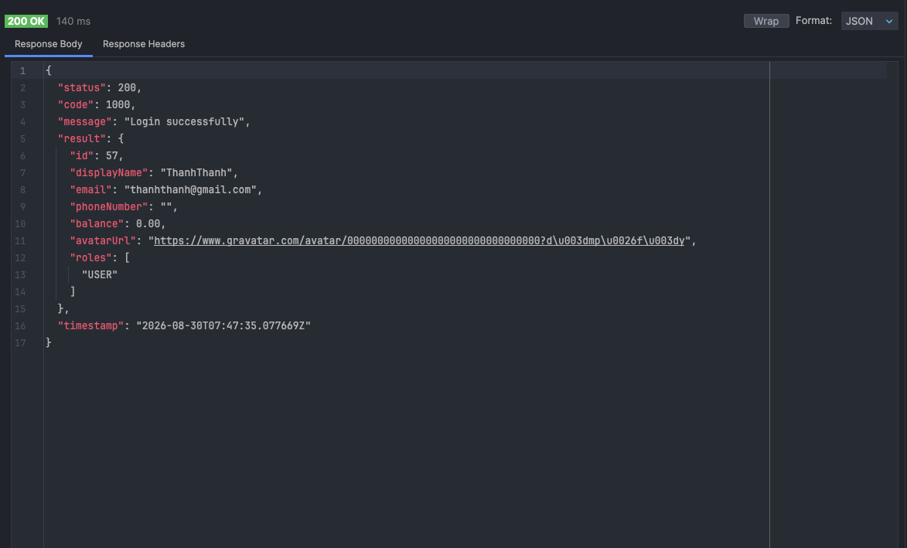

<div align="center">

#  SpringLens
### SpringLens - Spring Boot RESTful API Tester for IntelliJ IDEA

[](https://github.com/ThanhMiLa/SpringLens/actions)
[](https://github.com/ThanhMiLa/SpringLens/releases)
[](./LICENSE)
[](https://www.oracle.com/java/)
[](https://spring.io/projects/spring-boot)

---


</div>

---

## 🌟 Overview

**SpringLens** is a powerful, lightweight RESTful API testing client integrated directly into IntelliJ IDEA. Designed specifically for Spring Boot and Spring Cloud developers, it allows you to test, debug, and manage your APIs instantly without leaving your editor.

SpringLens automatically scans your project to organize all endpoints into an intuitive tree, generates mock JSON request bodies from your DTOs, effortlessly handles Spring Cloud Gateway routing, and provides one-click authentication sharing — delivering a complete, Postman-grade testing experience right where you code.

---

## ✨ Key Features

| Feature | Description |
|---|---|
| 🔍 **Deep AST/PSI Endpoint Scanner** | Scans `@RestController`, `@GetMapping`, `@PostMapping`... across all modules with full `@PathVariable` regex and `@RequestPart` Multipart support. |
| ⚡ **Instant DTO Schema Sync** | One-click JSON body generator from Java DTO classes with recursive reference protection and smart merge. |
| 🌐 **Spring Cloud Gateway Ready** | Auto-detects Gateway routes, computes reverse rewrites (`StripPrefix`, `PrefixPath`, `RewritePath`), and preserves service `context-path`. |
| 🔑 **One-Click Bearer Token Sharing** | Set your Bearer JWT Token once and sync it across all project endpoints in a single click with **"Apply to All APIs"**. |
| 📁 **Custom Endpoints & Collections** | Create manual endpoints and custom folders to test external APIs, third-party webhooks, or ad-hoc requests alongside scanned project endpoints. |
| 🔒 **Dev-Friendly SSL** | Built-in Trust-All SSL handler for local microservices running on self-signed `https://localhost` certificates without handshake failures. |
| 💾 **Workspace State Persistence** | Preserves all custom headers, parameters, and request bodies per-project across IDE restarts. |
| 📋 **Instant cURL Export** | One-click copy for ready-to-run `curl` commands for terminal testing and team collaboration. |

---

## 📸 Screenshots & Showcase

<div align="center">

### 1. Workspace Overview


<br/>

### 2. Endpoints Navigator


<br/>

### 3. Request Body & DTO Sync


<br/>

### 4. Request Parameters


<br/>

### 5. Authentication & Bearer Token


<br/>

### 6. Response Viewer


</div>

---

## 🚀 Getting Started

### 1. Installation

#### Option A: JetBrains Marketplace (Recommended)
1. In IntelliJ IDEA, go to **Settings/Preferences** (`Cmd + ,` or `Ctrl + Alt + S`) > **Plugins**.
2. Select the **Marketplace** tab and search for **`SpringLens`**.
3. Click **Install** and restart the IDE.

#### Option B: Install from Disk (.zip)
1. Download `SpringLens-1.0.0.zip` from [GitHub Releases](https://github.com/ThanhMiLa/SpringLens/releases).
2. Go to **Settings** > **Plugins** > click the ⚙️ icon > **Install Plugin from Disk...**.
3. Select the downloaded `.zip` file and restart IntelliJ IDEA.

#### Option C: Build from Source
```bash
git clone https://github.com/ThanhMiLa/SpringLens.git
cd SpringLens
./gradlew buildPlugin
```
The packaged plugin will be available at `build/distributions/SpringLens-1.0.0.zip`.

---

## 🛠️ Usage Guide

1. **Open your Spring Boot Project**: SpringLens automatically parses all controllers upon opening the tool window.
2. **Open the Tool Window**: Click the **SpringLens** icon on the right tool window bar.
3. **Select an Endpoint**: Browse the tree organized by `Service / Module` ➔ `Controller` ➔ `API Endpoint`.
4. **Customize Request**:
   - Fill in Query Parameters or Path Variables.
   - Attach Custom Headers.
   - Enter JSON Body (or click **Sync DTO** to generate schema from Java classes).
   - Set Auth token (and click **Apply to All** if testing protected APIs).
5. **Hit Send**: View formatted JSON response, status code, and latency metrics instantly!

---

## 🏗️ Architecture & Tech Stack

- **Platform SDK**: IntelliJ Platform Plugin SDK (Java 21)
- **Code Analysis**: JetBrains Java PSI (Program Structure Interface) AST
- **HTTP Engine**: Square OkHttp 4 (Async Execution, Trust-All SSL, Connection Pooling)
- **Serialization**: Google Gson
- **Testing**: JUnit 4 (54 Automated Unit Tests, 100% Core Logic Coverage)

---

## 🤝 Contributing

Contributions, issues, and feature requests are welcome!  
Feel free to check the [issues page](https://github.com/ThanhMiLa/SpringLens/issues).

1. Fork the Project
2. Create your Feature Branch (`git checkout -b feature/AmazingFeature`)
3. Commit your Changes (`git commit -m 'Add some AmazingFeature'`)
4. Push to the Branch (`git push origin feature/AmazingFeature`)
5. Open a Pull Request

---

## 📄 License

*SpringLens is under the Apache 2.0 license. See the [Apache License 2.0](./LICENSE) file for details.*

---

*Plugin based on the [IntelliJ Platform Plugin Template](https://github.com/JetBrains/intellij-platform-plugin-template)*

<br/>

<div align="center">
  <sub>Made with ❤️ by <a href="https://github.com/ThanhMiLa">ThanhMiLa</a> for the Spring Developer Community.</sub>
</div>

