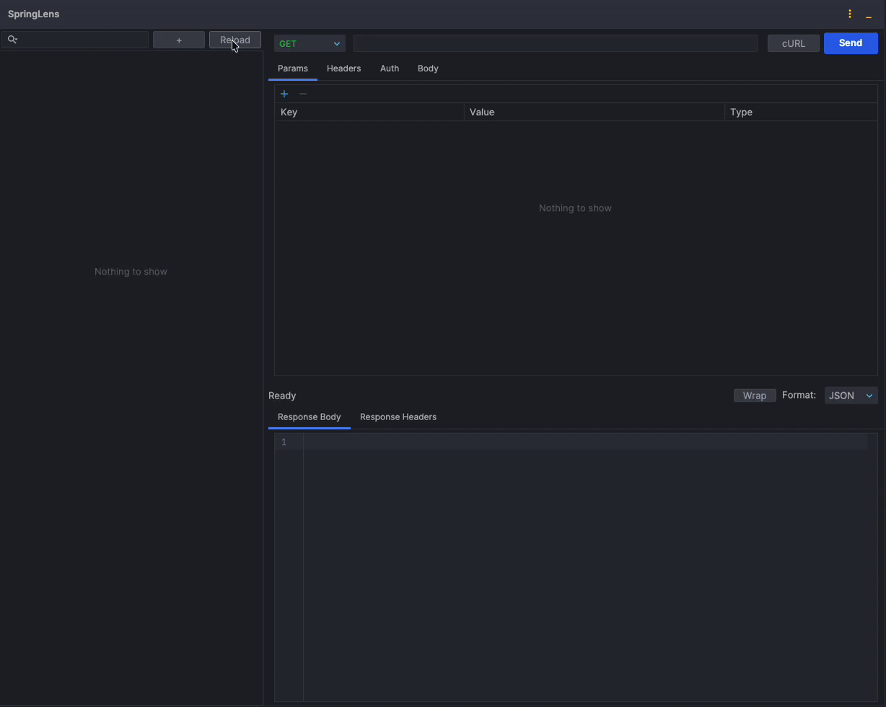
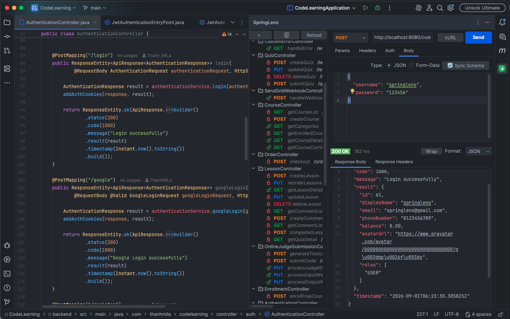
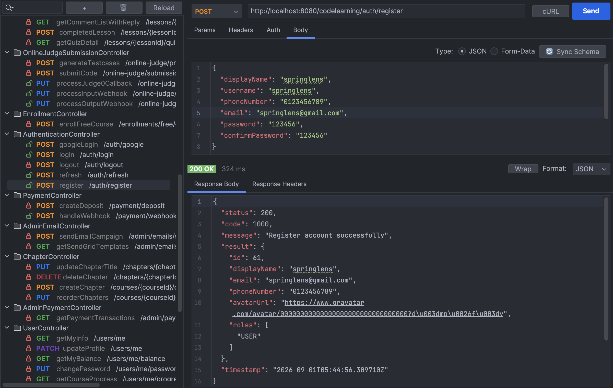
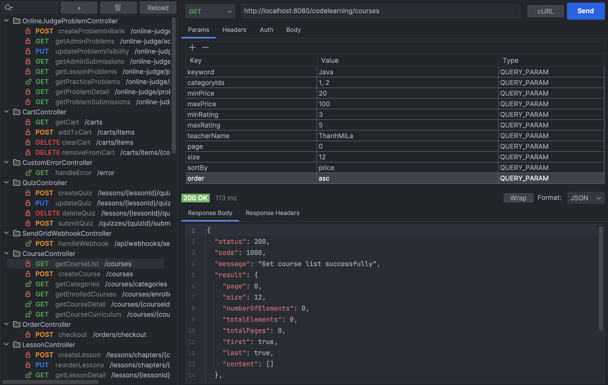
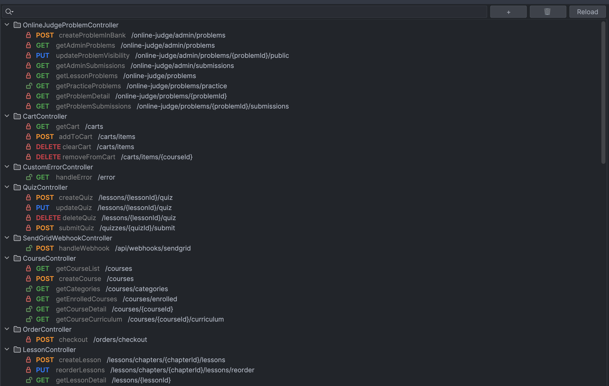

<div align="center">

#  SpringLens
### Spring Boot RESTful API Tester for IntelliJ IDEA

[](https://github.com/ThanhMiLa/SpringLens/actions)
[](https://github.com/ThanhMiLa/SpringLens/releases)
[](./LICENSE)
[](https://www.oracle.com/java/)
[](https://spring.io/projects/spring-boot)




</div>


## Overview

**SpringLens** is a powerful, lightweight RESTful API testing client integrated directly into IntelliJ IDEA. Designed specifically for Spring Boot and Spring Cloud developers, it allows you to test, debug, and manage your APIs instantly without leaving your editor.

SpringLens automatically scans your project to organize all endpoints into an intuitive tree, generates mock JSON request bodies from your DTOs, effortlessly handles Spring Cloud Gateway routing, and provides one-click authentication sharing — delivering a complete, Postman-grade testing experience right where you code.


## Key Features

| Feature | Description |
|---|---|
| **Deep AST/PSI Endpoint Scanner** | Scans `@RestController`, `@GetMapping`, `@PostMapping`... across all modules with full `@PathVariable` regex and `@RequestPart` Multipart support. |
| **Instant DTO Schema Sync** | One-click JSON body generator from Java DTO classes with recursive reference protection and smart merge. |
| **Spring Cloud Gateway Ready** | Auto-detects Gateway routes, computes reverse rewrites (`StripPrefix`, `PrefixPath`, `RewritePath`), and preserves service `context-path`. |
| **One-Click Bearer Token Sharing** | Set your Bearer JWT Token once and sync it across all project endpoints in a single click with **"Apply to All APIs"**. |
| **Custom Endpoints & Collections** | Create manual endpoints and custom folders to test external APIs, third-party webhooks, or ad-hoc requests alongside scanned project endpoints. |
| **Dev-Friendly SSL** | Built-in Trust-All SSL handler for local microservices running on self-signed `https://localhost` certificates without handshake failures. |
| **Workspace State Persistence** | Preserves all custom headers, parameters, and request bodies per-project across IDE restarts. |
| **Instant cURL Export** | One-click copy for ready-to-run `curl` commands for terminal testing and team collaboration. |


## Screenshots

### 1. IDE Integration & Workspace Overview


### 2. Request Body & Response Viewer


### 3. Query & Path Parameters


### 4. Endpoint Explorer & Security Status



## Installation

### Option A: JetBrains Marketplace (Recommended)
1. In IntelliJ IDEA, go to **Settings/Preferences** (`Cmd + ,` or `Ctrl + Alt + S`) > **Plugins**.
2. Select the **Marketplace** tab and search for **`SpringLens`**.
3. Click **Install** and restart the IDE.

### Option B: Install from Disk (.zip)
1. Download `SpringLens-1.1.2.zip` from [GitHub Releases](https://github.com/ThanhMiLa/SpringLens/releases).
2. Go to **Settings** > **Plugins** > click the Settings icon > **Install Plugin from Disk...**.
3. Select the downloaded `.zip` file and restart IntelliJ IDEA.

### Option C: Build from Source
```bash
git clone https://github.com/ThanhMiLa/SpringLens.git
cd SpringLens
./gradlew buildPlugin
```
The packaged plugin will be available at `build/distributions/SpringLens-1.1.2.zip`.


## TLS Security

SpringLens validates HTTPS certificates and hostnames by default. For trusted local development servers only, an endpoint can explicitly enable insecure TLS for `localhost` or loopback addresses. Never enable this option for remote hosts or production traffic.

Authentication credentials are stored with IntelliJ PasswordSafe rather than project XML. Request-body and response-history persistence are disabled by default because those values may contain sensitive data; enable either option explicitly in the SpringLens tool window when needed.

## License

SpringLens is under the Apache 2.0 license. See the [Apache License 2.0](./LICENSE) file for details.


*Plugin based on the [IntelliJ Platform Plugin Template](https://github.com/JetBrains/intellij-platform-plugin-template)*
